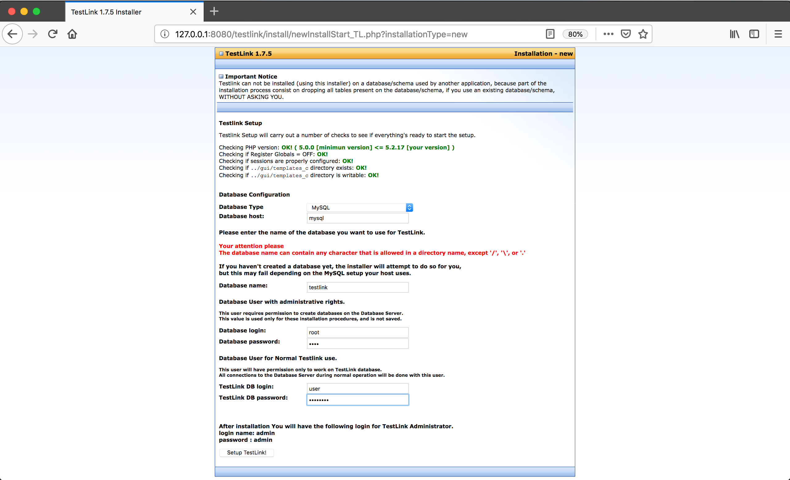

# docker-testlink-1.7.5

Testlink 1.7.5 Docker Image

## Description

An installable [Testlink](http://testlink.org/) 1.7.5 image on top of the following backend:

- Ubuntu 12.04
- PHP 5.2.17
- Apache 2.2.22


## Build

You can build the image following the usual procedure:

1 - Clone this repo

```shell
git clone https://github.com/charlysan/docker-testlink-1.7.5.git
```

2 - build docker image

```shell
docker build -t my-custom-testlink-1.7.5 .
```

You can also build the image using a different testlink version by setting the tgz source file URL:

```shell
--build-arg testlink_src<tgz_file_url>
```

E.g.

```shell
docker build \
  --build-arg testlink_src=https://sourceforge.net/projects/testlink/files/TestLink%201.8/TestLink%201.8.5/testlink_1.8.5.tgz \
  -t my-custom-testlink-1.8.5 .
```

### Important Note

Keep in mind that the newest versions of testlink will not work properly as they are not compatible with PHP 5.2.x. The purpose of this image was just to recreate a legacy Testlink 1.7.5 environment for developing purposes.

## Usage

1 - Pull Docker image from Docker Hub

```shell
docker pull charlysan/testlink-1.7.5
```

2 - Run Docker Image

```shell
docker run \
   -p 8080:80 \
   -v tlink_data:/project/testlink \
   charlysan/testlink-1.7.5
```

You should be able to access the installation page at [http://127.0.0.1:8080/testlink](http://127.0.0.1:8080/testlink)

### Run using docker-compose

A [Docker Compose](https://docs.docker.com/compose/) file has been included. This script will allow you to startup Testlink 1.7.5 along with MySQL 5.5. You can startup all the containers like this:


```shell
docker-compose -f docker-compose.yml up
```

You should be able to access the installation page at 
[http://127.0.0.1:8080/testlink](http://127.0.0.1:8080/testlink)

The credentials to be used for MySQL are specified within [docker-compose.yml file](docker-compose.yml).

For *Database host* use: **mysql**



From that point you should follow the installation steps described in Testlink Installation Manual.


## Credits

All credits to [kuborgh/docker-php-5.2](https://github.com/kuborgh/docker-php-5.2) for creating and sharing the PHP 5.2 Docker Image.

